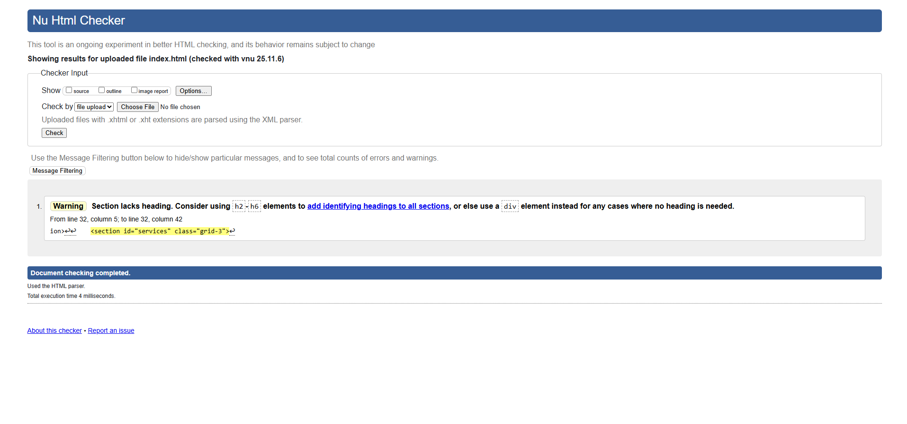
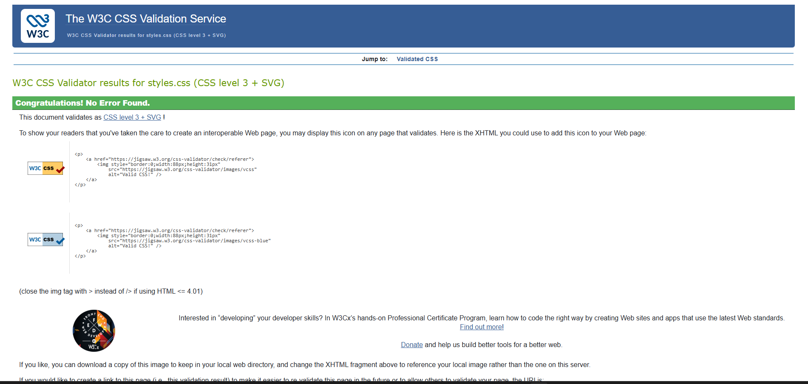

# Elite Online Tuitions — Assignment 02

This project is a responsive single‑page website built using HTML5 and CSS3 for the course assignment.  
It represents a fictional online tuition service named Elite Online Tuitions.

# Project Overview

The webpage includes:

# Layout & Structure
- Semantic HTML structure (`header`, `section`, `article`, `nav`, `footer`)
- CSS Grid for page layout structure
- Flexbox for cards, instructor section, and plan layout
- Responsive design with multiple breakpoints (desktop, tablet, mobile)

# Smart HTML Form
Includes all required elements:
- Text inputs (Full Name, Email)
- Checkbox group (Subjects)
- Radio button group (Plans)
- Select dropdown (Academic Level)
- Text area (Comments)
- Submit button with CSS ripple animation
- Proper labels and accessibility focus styles

# CSS‑Only Interactive Components
1. Card hover scale animation
2. Button ripple hover effect
3. Logo hover zoom animation

These effects are implemented entirely using CSS.

# Design Rationale

The theme uses:
- A blue & white color scheme (#23395d, #3454D1) suitable for an educational brand  
- Soft shadows and rounded cards for a clean modern interface  
- Easy‑to‑scan sections with a simple and accessible layout  

The design goal is clarity, professionalism, and readability.

# Assets

The assets/ folder contains:
- logo.png   
- logo.svg 
- html_validator.png
- css_validator.png
- screenshot home.png
- screenshot form.png
- screenshot FAQ.png

# Validator Proofs

# HTML Validation

# CSS Validation

# Link to Website

https://m-mueez-ashfaq.github.io/Elite-Online-Tuitions/

# Author  
M.Mueez Ashfaq
25L_3054  
